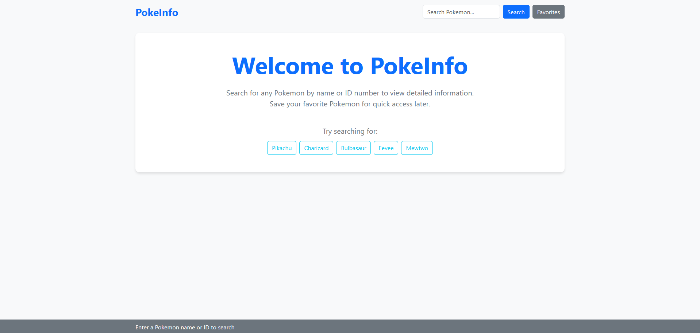

# README - Proyecto PokeInfo

## Introducción

PokeInfo es una aplicación web que permite consultar y almacenar información sobre Pokemon. Esta herramienta combina una interfaz web con una base de datos MySQL para ofrecer un acceso rápido y eficiente a los datos. El sistema consulta la API oficial de Pokemon cuando se solicita información por primera vez, almacenándola en una base de datos local para optimizar consultas posteriores.

## Requisitos del Sistema

Para ejecutar correctamente esta aplicación es necesario disponer del siguiente software:

- **Node.js**: Versión 14 o superior
- **MySQL**: Versión 8.0 o superior

## Proceso de Instalación

### 1. Configuración del Entorno

- Abra una terminal de comandos.
- Navegue hasta el directorio del proyecto: `cd ruta/a/PokeInfo`
- Instale las dependencias necesarias: `npm install`

### 2. Configuración de la Base de Datos

- Abra el archivo `config/db.js` con un editor de texto.
- Verifique que los parámetros de conexión sean correctos.

### 3. Ejecución de la Aplicación

- En la terminal, ejecute el comando: `npm run dev`
- Abra su navegador web y acceda a: `http://localhost:3000`
- La aplicación estará lista para realizar consultas.

## Características Principales

El proyecto consta de las siguientes puntos: 

- **Búsqueda de Pokemon**: Mediante nombre o número identificador.
- **Visualización de información detallada**: Tipos, habilidades, dimensiones y otras características.
- **Almacenamiento automático**: Los datos consultados se guardan en la base de datos local.
- **Indicador de fuente de datos**: La interfaz muestra si los datos provienen de la API o de la base de datos local.

## Dependencias Principales

Para la realización de este proyecto he hecho uso de las siguientes dependencias. 

- **express**: Framework web para Node.js
- **ejs**: Motor de plantillas para la generación de vistas HTML
- **mysql2**: Conector para interactuar con la base de datos MySQL
- **axios**: Cliente HTTP para realizar peticiones a la API de Pokemon

A continuación se puede visualizar algunas capturas del proyecto: 

---------------------

Desarrollado por Carlos Ochoa